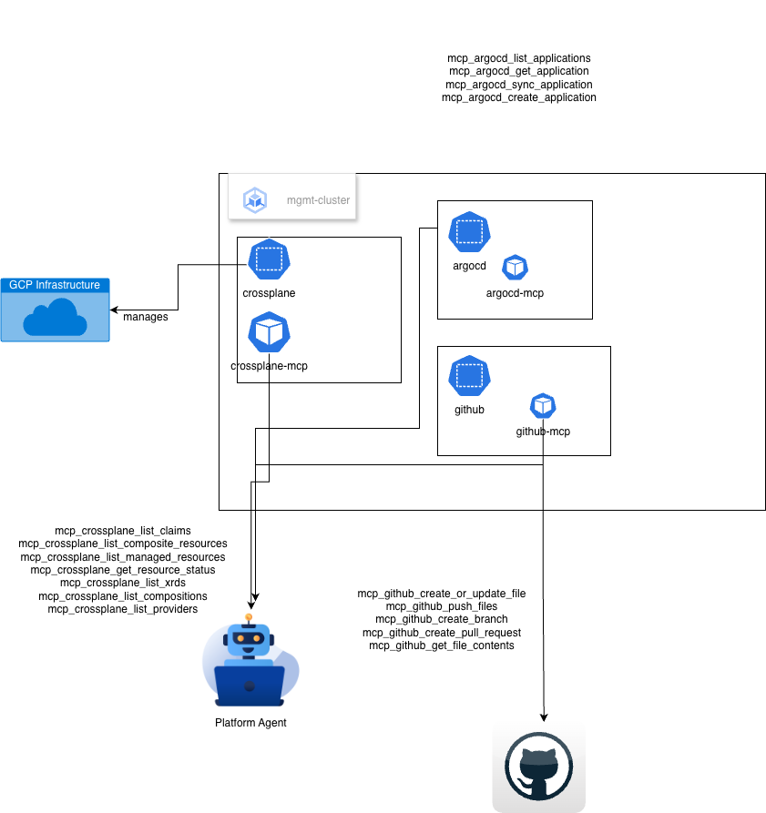

# Agentic Platform Engineering



## Overview

**Agentic Platform Engineering** is a next-generation internal developer platform (IDP) that leverages AI agents to autonomously manage, provision, and troubleshoot cloud infrastructure. By integrating **Model Context Protocol (MCP)** with industry-standard GitOps and Infrastructure-as-Code (IaC) tools, this project enables a natural language interface for complex infrastructure operations.

This repository serves as a unified stack for building an "Agent-in-the-Loop" platform, combining:
- **ArgoCD** for GitOps-driven continuous delivery.
- **Crossplane** for declarative, Kubernetes-native infrastructure provisioning.
- **Model Context Protocol (MCP)** to expose platform tools to Large Language Models (LLMs).
- **Go-based Agents** that orchestrate infrastructure changes via natural language commands.

---

## Key Features

- 🤖 **Autonomous Infrastructure**: AI agents can list, sync, and diagnose ArgoCD applications and Crossplane resources.
- 🏗️ **Declarative Everything**: Uses Crossplane XRDs (Composite Resource Definitions) to provide a high-level abstraction for cloud resources (GKE, GCS, etc.).
- 🔄 **GitOps-First**: Implements the "App-of-Apps" pattern for hierarchical resource management.
- 🔌 **Standardized Tooling**: Implements multiple MCP servers in Go for seamless integration with AI agents.
- 🏢 **Multi-Tenant Design**: Pre-configured infrastructure patterns for multiple teams and environments.

---

## Project Structure

```bash
agentic-platform-engg/
├── argocd-mcp/          # Go-based MCP server for ArgoCD management
├── crossplane-mcp/      # Go-based MCP server for Crossplane infrastructure
├── github-mcp-server/   # Go-based MCP server for GitHub operations
├── mgmt-cluster-infra/  # Bootstrap scripts and configs for the management cluster
├── platform-agent/      # AI agent implementation using ADK (Go)
├── infrastructure/      # Multi-tenant GitOps resource definitions (Team 1, Team 2)
└── mcp-for-argocd/      # Legacy TypeScript-based ArgoCD MCP server
```

---

## Getting Started

### 1. Bootstrap the Management Cluster
Navigate to the `mgmt-cluster-infra` directory and follow the instructions to set up your GKE cluster, Crossplane, and ArgoCD.
[Learn more about bootstrapping &rarr;](./mgmt-cluster-infra/README.md)

### 2. Deploy MCP Servers
Build and run the MCP servers located in `argocd-mcp`, `crossplane-mcp`, and `github-mcp-server`. These servers allow the AI agent to interact with your platform APIs.

### 3. Run the Platform Agent
Configure the `platform-agent` with the necessary MCP endpoint URLs and your LLM provider credentials to start interacting with your infrastructure via natural language.

---

## Architecture

The platform follows a three-layer architecture:
1. **Control Plane**: GKE running ArgoCD and Crossplane.
2. **Connectivity Layer**: MCP Servers providing a bridge between platform APIs and LLMs.
3. **Agentic Layer**: The AI Agent (ADK-based) that processes user intent and executes tools.

---

## Technical Stack

- **Languages**: Go, TypeScript
- **Infrastructure**: Google Cloud Platform (GCP), GKE
- **Tools**: Crossplane, ArgoCD, Helm, Docker
- **Protocols**: Model Context Protocol (MCP), SSE, stdio

---

## License

MIT License
